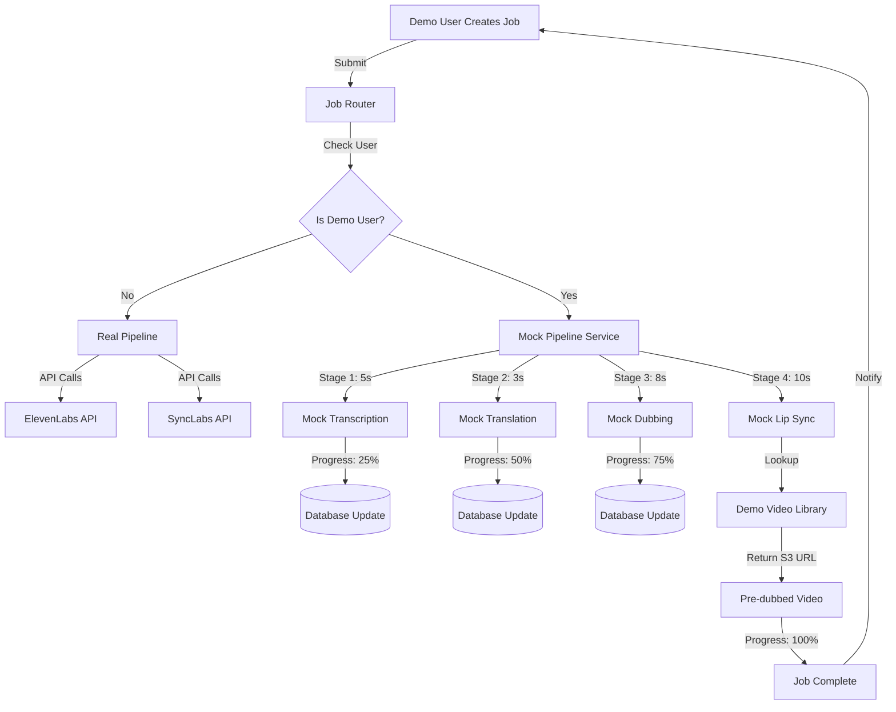

# Complete Pipeline Mock Demo

## Overview

Create a comprehensive mock of the entire dubbing pipeline that simulates realistic processing with progress bars, using pre-configured video pairs from S3. Demo user will see: job creation → transcription (5s) → translation (3s) → dubbing (8s) → lip sync (10s) → completion, with real progress updates but using pre-dubbed videos from S3.

## Architecture



## Demo Video Library Structure

Multiple pre-configured video pairs for rich demo experience:

```python
DEMO_VIDEO_LIBRARY = {
    "video_001_yceo": {
        "id": "demo_real_video_001",
        "title": "The Nature of Startups with YC CEO",
        "original_url": "https://olleey-videos.s3.us-west-1.amazonaws.com/en.mp4",
        "languages": {
            "es": {
                "dubbed_video": "https://olleey-videos.s3.us-west-1.amazonaws.com/es.mov",
                "dubbed_audio": "https://olleey-videos.s3.us-west-1.amazonaws.com/es-audio.mp3",
                "transcript": "Hola, hoy vamos a hablar sobre...",
                "translation": "..."
            },
            "fr": {
                "dubbed_video": "...",  # Add more as you create them
            }
        },
        "duration": 180,
        "thumbnail": "..."
    },
    "video_002_demo": {
        # Add more demo videos here
    }
}
```

## Implementation Steps

### 1. Create Demo Video Library Configuration

**File:** `config.py`

Add comprehensive demo video library with multiple videos and languages:

```python
# Demo Video Library - Multiple pre-configured videos
DEMO_VIDEO_LIBRARY = {
    "video_001_yceo": {
        "id": "demo_real_video_001",
        "title": "The Nature of Startups with YC CEO",
        "description": "In-depth discussion about startups",
        "original_url": "https://olleey-videos.s3.us-west-1.amazonaws.com/en.mp4",
        "thumbnail": "https://olleey-videos.s3.us-west-1.amazonaws.com/thumb.jpg",
        "duration": 180,
        "languages": {
            "es": {
                "dubbed_video_url": "https://olleey-videos.s3.us-west-1.amazonaws.com/es.mov",
                "dubbed_audio_url": "https://olleey-videos.s3.us-west-1.amazonaws.com/es-audio.mp3",
                "transcript": "Welcome to this discussion...",  # Mock transcript
                "translation": "Bienvenido a esta discusión...",  # Mock translation
            },
            # Add more languages as you create them
        }
    },
    # Add more videos here as you expand demo library
}

# Pipeline timing configuration (in seconds)
DEMO_PIPELINE_TIMING = {
    "transcription": 5,
    "translation": 3,
    "dubbing": 8,
    "lip_sync": 10,
}
```

### 2. Create Mock Pipeline Service

**New file:** `services/mock_pipeline.py`

Complete mock pipeline orchestrator - see full implementation in plan file.

### 3. Create Mock ElevenLabs Dubbing Service

**New file:** `services/mock_elevenlabs.py`

Mock for ElevenLabs Dubbing API - see full implementation in plan file.

### 4. Enhance SyncLabs Mock

**File:** `services/synclabs.py`

Update existing mock (lines 107-121) to use demo library.

### 5. Update Job Processing Router

**File:** `routers/jobs.py`

Integrate mock pipeline for demo users.

### 6. Update Demo Simulator

**File:** `services/demo_simulator.py`

Update source_videos config to match DEMO_VIDEO_LIBRARY.

### 7. Create Testing Script

**New file:** `scripts/test_demo_pipeline.py`

Comprehensive test for full pipeline.

### 8. Update Database Schema (if needed)

```sql
-- Add if not exists
ALTER TABLE processing_jobs ADD COLUMN IF NOT EXISTS current_stage TEXT;
ALTER TABLE processing_jobs ADD COLUMN IF NOT EXISTS stage_details JSONB;
```

## Demo Flow Timeline

User perspective when creating a job:

```
0s   - Job submitted
      ↓ "Transcribing audio..."
5s   - [25%] Transcription complete
      ↓ "Translating to Spanish..."
8s   - [50%] Translation complete
      ↓ "Generating dubbed audio..."
16s  - [75%] Dubbing complete
      ↓ "Applying lip sync..."
26s  - [100%] Complete! Ready for review
```

Total: ~26 seconds (vs 5-10 minutes for real processing)

## Frontend Integration

### How It Works

The frontend **already has real-time job update infrastructure** via Server-Sent Events (SSE) that will automatically receive and display progress updates.

### Existing Infrastructure (No Changes Needed!)

- ✅ Server-Sent Events (SSE) connection to `/events/stream` (`useJobEvents.ts`)
- ✅ Real-time job updates without polling
- ✅ Automatic fallback to polling if SSE fails
- ✅ Job state updates pushed from backend
- ✅ Hook to monitor specific job status (`useJobPolling.ts`)
- ✅ Review modal that loads and plays videos (`review-job-modal.tsx`)

### What Happens Automatically

1. **Job Creation** - User creates job, backend starts mock pipeline (async)
2. **Progress Updates** - Mock pipeline updates database, SSE pushes to frontend
3. **Job Cards Update** - Dashboard shows animated progress bars
4. **Review Flow** - When complete, "Review" button appears, modal loads S3 video

### Backend SSE Implementation Needed

Add SSE endpoint and emit events when progress updates. See plan file for full implementation.

### Summary: Frontend Changes Required

**ZERO changes required** to existing UI components! The frontend is already set up for real-time updates.

## Testing Checklist

1. Login as demo user (demo@olleey.com)
2. Upload/select original video
3. Select target language(s)
4. Create job
5. Watch progress bar update through stages
6. Verify each stage shows correctly
7. Job completes in ~26 seconds
8. Review modal shows Spanish dubbed video from S3
9. Video plays correctly
10. Approve and publish workflow

## Benefits

- **Realistic demo**: Shows actual processing stages with progress
- **Fast execution**: 26 seconds vs 5-10 minutes
- **Multiple videos**: Support for growing demo library
- **Multiple languages**: Easy to add more language pairs
- **Real videos**: Uses actual S3-hosted dubbed content
- **Demo-only**: Zero impact on production users
- **Extensible**: Easy to add more videos/languages

## Future Enhancements

- Admin UI to manage demo video library
- Support for partial language availability
- Demo mode toggle in frontend settings
- Export/import demo library configurations
- WebSocket as alternative to SSE
